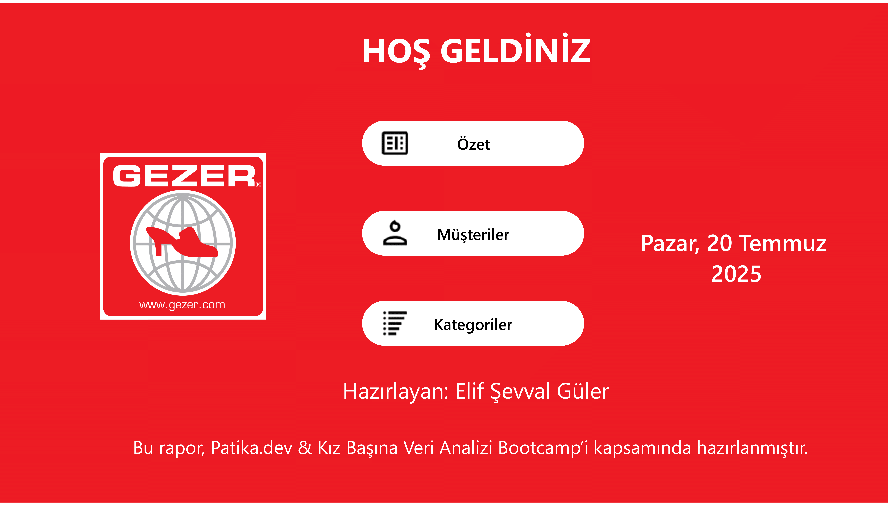
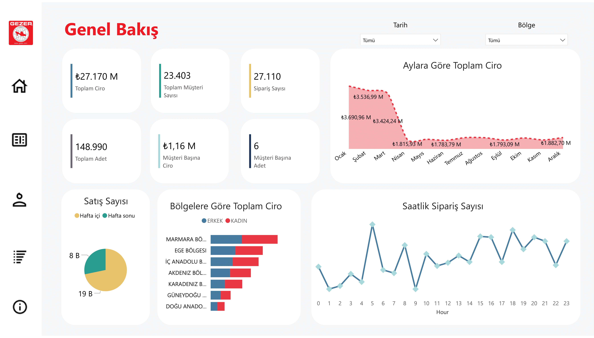
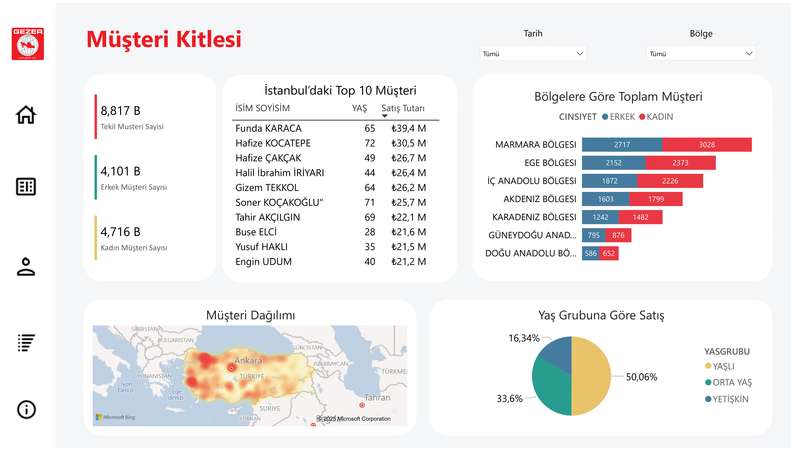
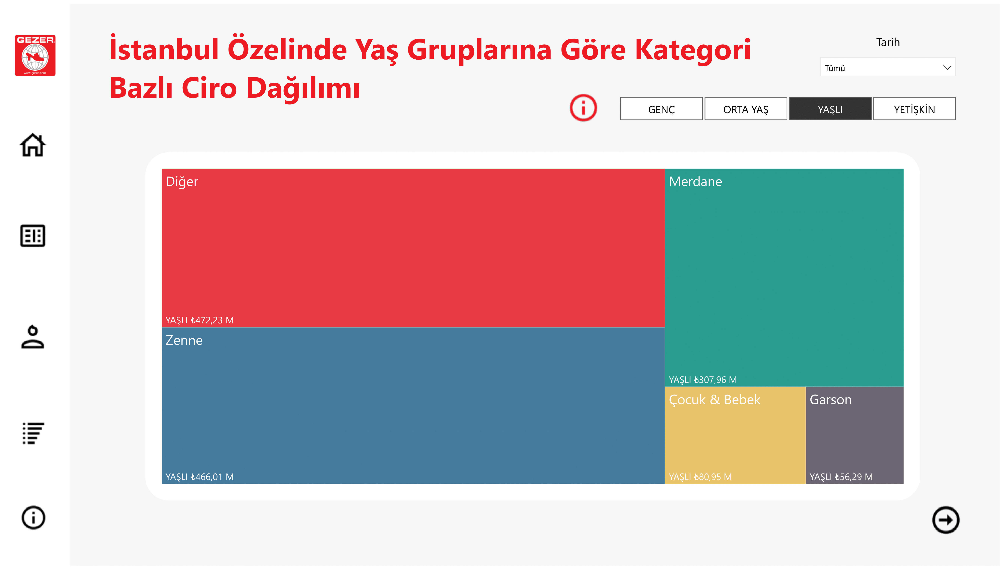
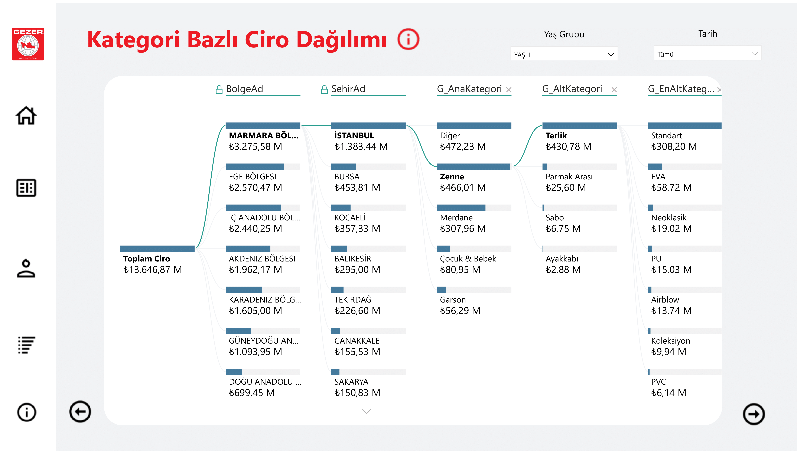
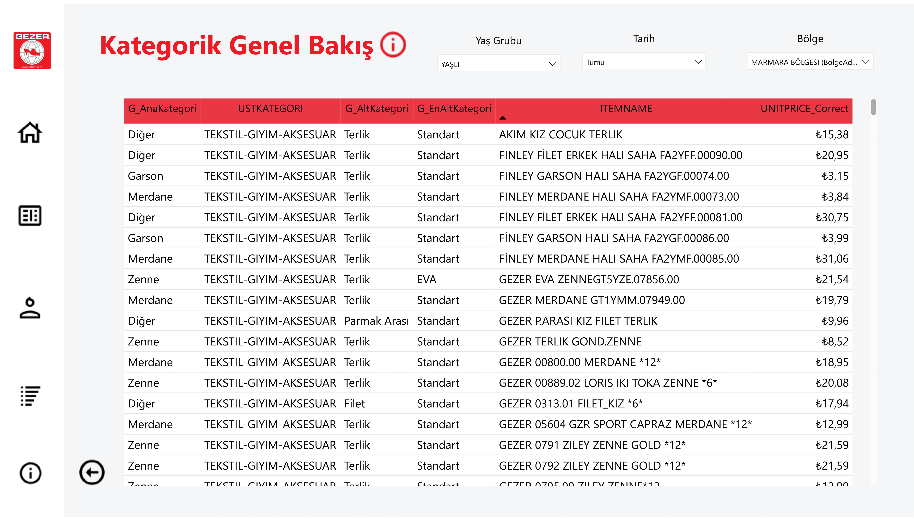

# GEZER Power BI Satış & Müşteri Analizi Dashboard'u

 **Bu proje**, Patika.dev & Kız Başına Veri Analizi Bootcamp kapsamında hazırlanmıştır.

Power BI kullanılarak **GEZER markasına** ait satış ve müşteri verileri analiz edilmiş, etkileşimli bir dashboard geliştirilmiştir.

---

##  Dashboard Özellikleri

-  **Zaman Bazlı Analizler**: Aylık ciro dağılımı, saatlik sipariş yoğunluğu, hafta içi / sonu karşılaştırması
-  **Müşteri Segmentasyonu**: Cinsiyet ve yaş grubuna göre analizler
-  **Bölgesel Analizler**: Bölgelere göre toplam ciro ve müşteri dağılımı
-  **Kategori Bazlı Dağılım**: Ürün kategorilerine göre satış analizi
-  **İstanbul Özel Analizi**: Yaş grubuna göre kategori tercihleri, en çok alışveriş yapan ilk 10 müşteri

---

## Power BI Dashboard

 Dashboard dosyasına aşağıdaki Drive linki üzerinden erişebilirsiniz:

 [GEZER Power BI Dashboard (PBIX Dosyası)](https://drive.google.com/drive/folders/1T22v5pFpdxL_neQyldVrlKi5cEQ_QFXn?usp=sharing)

> Not: Dosya boyutu yüksek olduğu için GitHub’a yüklenememiştir. Google Drive üzerinden paylaşıma açılmıştır.

---

## 📄 PDF Rapor (Görsel Sunum)

Dashboard’un görselleştirilmiş hali GitHub’a eklenmiştir:  

---

## 🛠 Kullanılan Teknolojiler

- Power BI Desktop
- DAX Fonksiyonları
- Veri Modelleme
- Slicer & Drillthrough
- Özet, Müşteri ve Kategori Perspektifleri

---

**Hazırlayan:**  
Elif Şevval Güler  
Temmuz 2025  
